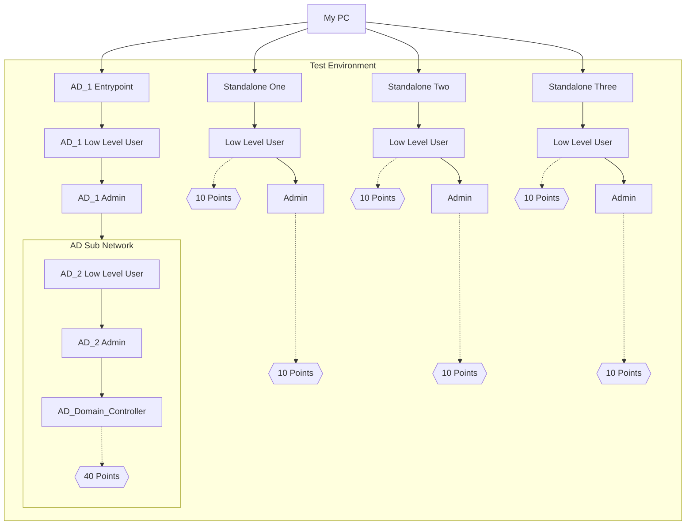

Recently I completed the Offensive Security Certified Professional (OSCP) exam. It was a very stressful but great learning experience and I wanted to share my thoughts and journey through the exam!

Quick disclaimer, this post leans slightly towards the technical side. Some details may be lost without prior knowledge of cyber-security related [[Hacking/Cyber Security Basic Terms and Concepts|terms and concepts]].

![[Assets/OffSec+Tagline_Full_Color_White_Text.png]]

The OSCP exam is a practical exam hosted by Offensive Security (OffSec) that challenges examinees to hack into provided machines in order to demonstrate their penetration testing (hacking) skills.
Examinees have 24 hours to hack as many of the provided machines as possible and an additional 24 hours to write a detailed report about their methodology and findings.

There are 100 points available to earn while only 70 points are needed to pass. The breakdown is as follows:
- 3 standalone machines worth 20 points each.
	- 10 points for gaining low level access
	- 10 points for gaining administrator access

- A set of 3 **interconnected** (known as [[Hacking/AD/Active Directory|Active Directory]] or AD) machines worth 40 points
	- All three need to be completed to earn 40 points
	- Only one IP Address is shared, serving as the entry point. The remaining two machines must be reached by 'jumping' from that entry point

As the exam is entirely online, I had the comfort of taking it from home, however the exam is monitored by proctors for the entire 24 hour duration to ensure no cheating or external interference is possible.

The process began with choosing a starting time. This was actually my second attempt at this certification exam. The first try ended in failure and left me demoralized to make a second attempt for over a year. I struggled a lot with feelings of imposter syndrome but I'm glad I was able to eventually muster up the courage to try again.

In that first attempt, I decided to start the exam in the morning at 9am. This ended up being a mistake as at around 2am, some 15 hours of hacking later, I had to make the decision to keep pushing into the night, or rest and accept I wasn't going to earn enough points to clear by the morning.

Keeping my previous attempt in mind, I wanted to give myself enough time after a night's rest in order to make additional progress. I set the exam time for 3PM, giving me an afternoon, evening, and full morning to work.

# Exam time

## Day One

### Getting into the mindset

On the day of the exam, I had cereal for breakfast and double-checked that my workstation was prepared.
- [x] Notes
- [x] Photo ID 
- [x] Coffee
- [x] Webcam
- [x] More Coffee

With that settled, I stretched out on the couch and relaxed a bit. My exam didn't start until the afternoon and I wanted to de-stress as much as possible. There are countless stories of people's experience tackling this exam. One common thread throughout is that the mental pressure can be just as challenging to overcome as the exam itself.

> Author's note: It was not fine

Having experienced that pressure first-hand in my original attempt, I was going to do my best to not let intruding thoughts of doubt and stress plague my mind. I played [[Gaming-Log|some games]], read a bit, and watched a lot of youtube.

15 minutes before the exam began, I went through an ID-check process and workstation inspection with the proctor. This involved using my webcam to sweep around the room and under my desk to ensure there were no prohibited items like mobile phones within reach. Once the proctor's checks had concluded, it was time to begin the exam at last.

### The foothold

Once the exam begins, I'm provided with a list of 4 IP addresses. These addresses correspond to the three standalone machines, and the initial AD machine that I will be targeting for the exam.

The first order of business is to check what services are running on a system. This practice is commonly known as [[Hacking/Port Scanning|Port Scanning]]. By checking every [[Hacking/Port|port]] to determine which ones are openly allowing traffic, it's possible to understand what services are running on a machine.

Machines with ports 80 and 443 open for example, are most likely web servers designed to serve content to be accessed by users via a web browser. This can be inferred as 80 and 443 are the port numbers reserved for serving HTTP and HTTPS traffic, the two main protocols used for delivering content like websites. From there, I know that I can likely use my web browser to visit the machine and see some kind of website that may have an vulnerability I can leverage in order to exploit the machine.

Establishing that first foothold on the system by identifying a vulnerability in a service is key towards gaining broader access to a network. In the case of the standalone machines, it often directly leads to low-level access that qualifies for 10 points.

### Roadblocks and Breakthroughs

The path of a hacker is one of perseverance. The motto of Offensive Security, the company running the OSCP certification, is "Try Harder". The mindset asks you to question if you *really* did try absolutely every possible avenue of attack.

There's some amount of controversy over their motto as it can be interpreted as dismissive or downplaying the efforts people have put into earning their certification and learning to hack. While I agree with some of arguments posed by critics against the Try Harder philosophy, I cannot argue that the type of mentality it encourages is what allowed me to succeed.

Like with many challenges, there are times a hacker will reach a wall halting their progress. Of course, this is an inevitable part of the [[Hacking/Cyber Security Basic Terms and Concepts#Penetration Testing Methodology|penetration testing methodology]]. The starting point and end goal may be known, but it's the steps in between that are often the most unclear. Once I'm able to exploit a machine and get low-level access, what do I do from there? What if I can achieve remote code execution, but my payload doesn't spawn a reverse shell? Adopting the Try Harder mentality is about being thorough. For many, this means [[Hacking/Privilege Escalation/Local Enumeration|developing a checklist]] or using [someone else's](https://book.hacktricks.xyz/). It also means keeping track of what has been done and what is yet to be tried. There's no use in attempting to same command or exploit in hopes that it will magically work after the second or third time.

![[Assets/hacking-in-progress.gif]]
> The definition of insanity is doing the same thing over and over and expecting different results.

With the stress and anxiety faced when up against a wall that doesn't seem to break, there is an equal amount of pure joy and enlightenment when the jigsaw piece slides into place and the wall is overcome. A large part of why this profession is so fulfilling is the seesaw of small setbacks and victories, each leading one step closer to total victory over the machine.

### Stuck

From my starting time of 3PM, by the time 5:30PM had hit, I was 50 points richer. 40 points earned from gaining Admin privileges on two standalone machines and another 10 points from low privilege access on the third. All I needed was to complete the 3 interconnected AD labs and I would have enough points to pass. 

Of course, it wasn't going to be *that* easy.

For the next few hours, I bashed my head against the initial entry-point of the AD set. While I had found a few potential leads, they all seemed to be dead ends. I went through my checklist once, twice, what felt like a dozen times, but after 5 hours of looking at the same screen with no glimpse of progress, it began to eat away at my mind that time was running out.

![[Assets/coraline-dad.gif|300]]
> Real footage taken from my exam attempt

Examinees are allowed to step away from the computer at any time, for any duration. An allowance I made liberal use of to stretch, grab more food and drink, or rant into the air about what my next steps were. Whether on the verge of a major breakthrough or pounding against the same brick wall, its important to take breaks often. While working on the AD entry-point, I must have stood up over a dozen times to pace the room or just to lie down and breathe.

### IT Support

Some opt to take the exam from a hotel room to remove themselves from distractions, or rent out some private space like an AirBnB.

As I took the exam from my cozy Kawasaki apartment, I shared the space with my significant other: Sunny (name altered for privacy).

Sunny was an endless source of support and optimism throughout the exam and I attribute a major part of my success towards her. Aside from keeping me fed and hydrated with a stream of snacks and drinks, she listened as I constantly bemoaned about how the exam was way too hard and how I had *still* gotten nowhere.

Her encouragement to ~~try harder~~ do my best and keep at it was enough to motivate me to continue. If I just step away and return with a fresh set of eyes and a rested mind, maybe I would find the path forward.

Sliding into bed at 11PM after 5 hours of no progress, my mind raced with ideas for what I had yet to try and what I could do differently. It's hard to say if I truly fell asleep that night, there were stretches of lucidity interspersed by hazy thoughts of the exam. My sleeping mind was still awake, dreaming of possible strategies and what would await me come daybreak.

## Day Two

### A breakthrough

I woke up at 8am feeling pretty...crappy. Unsurprisingly my sleep was not particularly restful. Regardless, there was work to be done, and checklists to recheck. I slinked back to my desk where my PC, which had been running throughout the night awaited. I greeted the proctor whom has since swapped shifts with a new staff member, letting them know I had returned from my extended break and would be resuming the exam. Upon their confirmation, it was time to dive back in.

Time was ticking, but I knew there was no point in rushing. There was nothing to do but be meticulous to ensure I hadn't missed anything.

Thankfully not ten minutes after returning, I spotted the critical piece of information that I had been missing this entire time. How my mind slipped past it so many times I don't know but I let out an audible shout of excitement as the puzzle began to unravel. While what I had missed was obvious in hindsight, it goes to show how important a break is.

I still needed to compromise the entire AD set of machines in order to earn the points needed to pass. This involves not only compromising the entry point, but then using that entry point as a pivot to gain access to a subnetwork wherein the remaining machines existed. I needed to work fast to pull all of this off within the limited time remaining.

### Sprinting to the finish

![[Assets/speed.gif]]
> I am speed

As luck would have it though, the techniques and exploits needed to progress were all things I had recently studied. It's hard to describe the sense of relief I felt as I made steady progress through the sub network. What once seemed like an uphill battle started to turn into a clear path to the finish line.

At 11am, a few hours since waking up on the second day, I typed a command into my PC, hit enter, and held my breath.

My terminal froze as the command executed, shooting electrons down the wire, hopping across networks and through pivots until it reached it's target. The bits and bytes got to work, nibbling at the firewall until the system's core OS was revealed. With a final "beep boop", it dove in, fulfilling it's destiny and granting me Domain Administrator privileges over the Active Directory network.

The actual technical details were of course less dramatic but the key takeaway was that I had earned the points needed to pass the exam! At last I was done, right? (wrong)

As with many things in the professional world, it's not enough to just **do** your job. You have to write a report about it too.

![[Assets/paperwork.gif]] 

## The Report
### But....why?
The OSCP exam serves to evaluate how well the examinee might perform in a real-life penetration test engagement. The role of a pentester is not *just* to hack into your client's systems. The real purpose of the engagement is to communicate *how* that was accomplished so that improvements to the system can be made.

For this reason, earning the necessary points needed to pass by completing the technical hacking portion of the exam means nothing unless the accompanying report is properly documented. Offensive Security demands for specific information to be included as proof of an examinees successful hack, including a detailed step-by-step guide on how to reproduce each vulnerability used to take over every machine. There are tales of people earning the full 100 points in the technical portion, only to miss documenting one critical step in their report and failing the exam. So of course going into this, I was quite paranoid that I may miss something down the line.

### Documentation is a hacker's best friend

I mentioned it before but the exam is split into two 24 hours periods. 24 hours to hack as many machines as possible, and another 24 hours to write and submit the report. Even if you earn all the points available, as long as the technical portion of the exam has not ended, the test machines are accessible. This makes going back to ensure your report is accurate and all information has been gathered possible.

Everyone has different methods of documenting their engagement. I know some who prefer to record their screen for the entire duration of the exam and then replay the video, writing the report following the steps they took. Others write the report as they hack, allowing for a bit of a head start once the lab is properly closed. I preferred to take the more common approach of taking screenshots as I went and making notes whenever I made progress, then writing the report once I had earned the points needed. This came with the downside of missing some screenshots and needing to run commands in an attempt to recreate the scenario of the missed screenshot.

### Fire and forget

Between writing the report and diving back into the test environment to grab screenshots while working against the time before the lab closed, it wasn't any less stressful than the actual hacking portion of the exam. In fact it was arguably worse. Once the labs closed all I had left to help complete the report was the notes I had taken. There were no additional opportunities to take screenshots or review my work. With that gnawing at me, I kept at it, eventually ended up with a decently sized report that I was relatively proud of. The report included an executive summary of the engagement, detailed step-by-step analysis of the vulnerabilities found that were exploited to compromise each machine, and recommendations for how to close the security holes found to prevent future intrusion. 

![[Assets/word-count.png]]
> Not too bad for a few hours of writing. Page count is perfect too!

I completed the report in the early evening of the second day, meaning there was technically still a full night, morning, and afternoon left before the submission deadline. However with the labs closed, I saw no point in delaying the report submission. I double and triple checked everything and sent it off.

# Results and Thoughts

It was already spoiled up top but I passed the exam.

It was a great mental and surprisingly physical challenge but gave me a much needed boost in confidence when it comes to my skills. In the end, it was an unforgettable experience, but not one that I would necessarily want to revisit. Unfortunately, Offensive Security provides higher level exams, some with durations of up to 72 hours, so it's possible in the future I may take on the challenge once more. For now though, I'll take a much needed break.

![[Assets/certified.png]]

If you made it this far, thanks for reading! My hope is that I was able to provide an interesting retelling of my personal experience and struggles during exam. This is the first blog I've released in a very long time so it's definitely a little rough around the edges. Nonetheless, I'd love to hear your thoughts. Just whisper to your router on a cloudy night of a full moon and I should receive your message. Until next time!