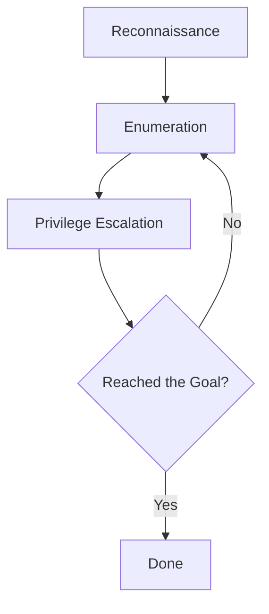

Cyber Security 

|Name|Description|
|-|-|
|Asset|The information or resources of a system|
|Vulnerability|A weakness in a system that can be used by an attacker|
|Exploit|The methodology or attack used to take advantage of a vulnerability|
|Attacker|A malicious entity from the perspective of the system|
|Whitehat|A hacker that conducts attacks with permission from the target with the intention of improving security (AKA Penetration Tester)|
|Blackhat|A hacker that conducts unauthorized attacks with malicious intent|
|Hashing Algorithm|A non-reversible algorithm that creates 1-1 mappings of inputs to outputs.|
|Encryption Algorithm|A reversible algorithm used to encrypt data. encrypted data must be decrypted before being read.|
|Reverse Engineering|Figuring out how a program works without access to it's source code. Generally used to describe the exploitation of binary files.|

# Penetration Testing Methodology

## 1. Reconnaissance

Survey and investigate potential attack vectors.

## 2. Enumeration

Exhaust each possible option.

## 3. Privilege Escalation

Craft the exploit to reach higher levels of privilege.

## 4. Repeat until Goal is reached.
The "goal" can be anything from obtaining complete control over the machine (typically getting Admin or Root user access), or stealing a specific file such as the password or credit card details of a company.

# Vulnerabilities & Exploits

#todo organize this

- XSS
- CSRF
- RFI/LFI
- RCE
- Path Traversal
- No/SQL Injection
- Code Injection
- Buffer Overflow
- Brute Force